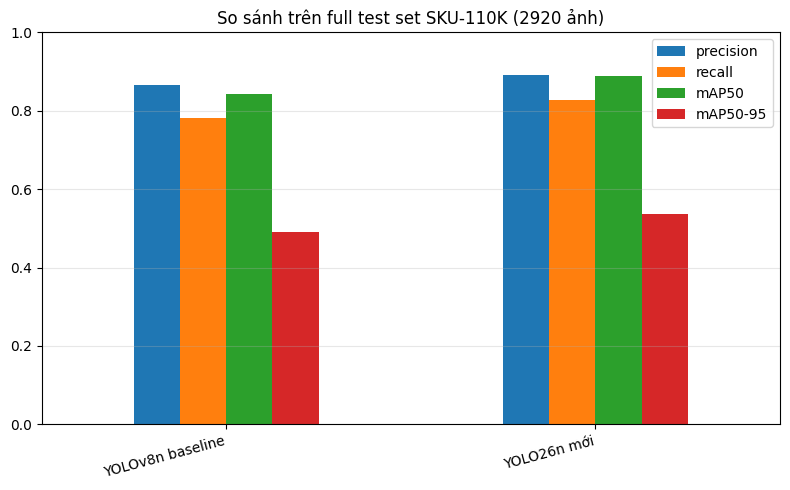
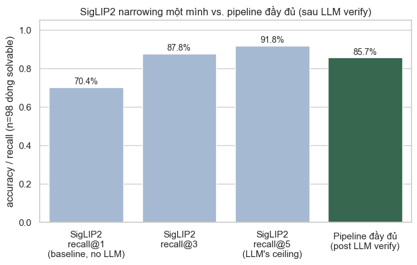
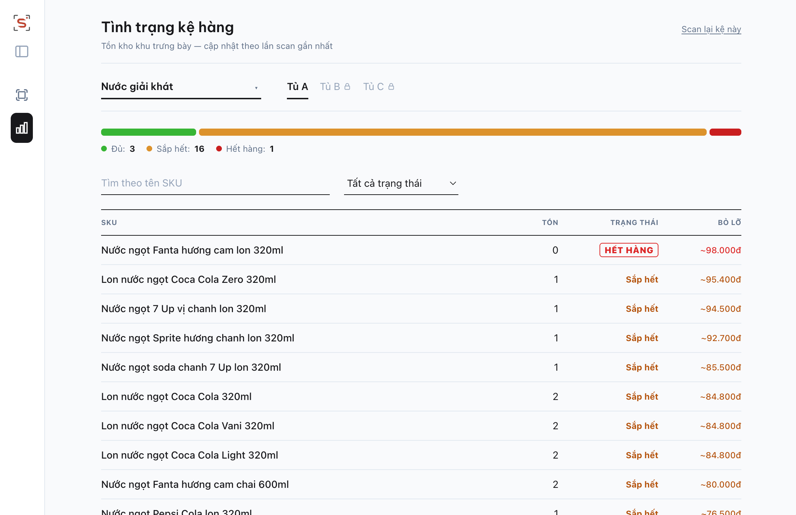
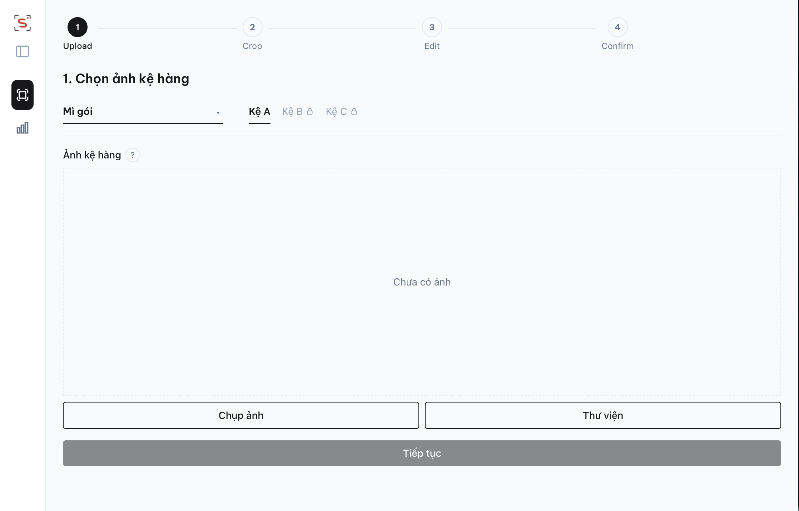
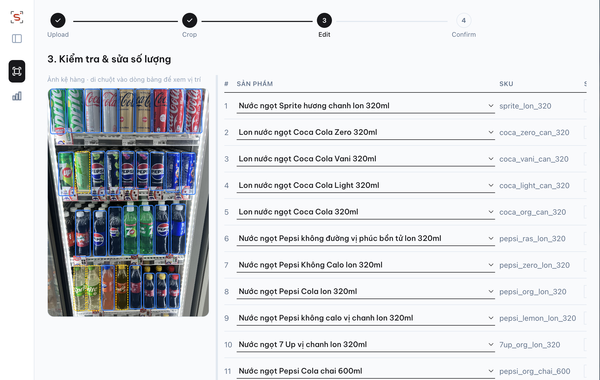

<p align="center">
  
</p>

# ShelfSense

Trợ lý kiểm kê kệ hàng bằng ảnh chụp, cho cửa hàng và siêu thị mini không có ngân sách lắp camera cố định hay hợp đồng SaaS enterprise.

> Dự án portfolio cá nhân (khóa AI thực chiến, 5 tuần, 20/7 đến 25/8/2026), không phải sản phẩm thương mại, không deploy public.

## Vấn đề

Kiểm kê tồn kho trên kệ hiện chủ yếu làm thủ công: nhân viên đếm tay từng sản phẩm, dễ bỏ sót vị trí trống dẫn đến mất doanh thu, và không có công cụ theo dõi tình trạng kệ nếu không đầu tư hạ tầng lớn.

Các giải pháp thị trường (Trax, Simbe Robotics/Tally, Focal Systems, AiFi, Scandit ShelfView) giải quyết đúng bài toán này nhưng nhắm vào chuỗi bán lẻ lớn: cần camera cố định, robot tự hành, hợp đồng dài hạn, hoặc train riêng model theo catalog từng khách hàng. Cửa hàng và siêu thị mini không có ngân sách và quy mô để tiếp cận các giải pháp này.

## Giải pháp

Nhân viên chụp 1 ảnh mảng kệ bằng điện thoại thường. Hệ thống tự khoanh vùng, đếm số lượng từng sản phẩm, phát hiện sản phẩm sắp hết hoặc hết hàng, rồi hiển thị lên dashboard.

Khác biệt kỹ thuật chính: dùng zero-shot classification (SigLIP2 embedding retrieval) thay vì train riêng model theo catalog của từng cửa hàng. Thêm SKU mới vào catalog không cần train lại model, khác với hướng closed-set classifier của nhiều đối thủ enterprise.

Kết quả AI luôn là bản nháp. Hệ thống chỉ ghi vào tồn kho chính thức sau khi nhân viên xác nhận.

## Kiến trúc

3 tầng, chạy local, không cloud:

| Tầng | Công nghệ | Vai trò |
|---|---|---|
| `web` | React 19, Vite, Tailwind v4 | Scan wizard (Upload, Crop, Analyze, Edit, Confirm), Dashboard theo category và kệ |
| `api` | Node.js, Express 5, SQLite (better-sqlite3) | Proxy mỏng, validate và format dữ liệu giữa web và ml-service |
| `ml-service` | Python, FastAPI | Pipeline CV: detect, classify, gap detection, LLM verify |

## Pipeline

1. **Detection**: YOLO26n fine-tune trên SKU-110K, khoanh vùng từng sản phẩm trên ảnh kệ (dense, overlapping objects).
2. **Classification**: crop từng box, dùng SigLIP2 embedding zero-shot để match với catalog sản phẩm (retrieval-based, không cần train riêng cho SKU mới).
3. **LLM verify**: mọi match từ SigLIP2 đều được xác nhận lại qua LLM (Gemini, fallback OpenRouter), vì điểm số embedding không đủ tin cậy để tự quyết định khi nào cần hỏi thêm.
4. **Gap detection**: 2 tầng, geometry sinh ứng viên khoảng trống trên kệ, VLM verify lại từng ứng viên (Gemma qua OpenRouter, fallback GPT) để loại phantom gap.
5. **Depth multiplier**: nhân viên tự nhập số lớp sản phẩm xếp sâu phía sau mỗi vị trí, chưa tự động suy luận độ sâu.
6. **Aggregate và Dashboard**: cộng dồn số lượng theo SKU, so với ngưỡng từng SKU để gắn cờ Đủ, Sắp hết, hoặc Hết hàng.

## Kết quả

**Detection (YOLO26n, full test set SKU-110K, 2920 ảnh):**

| Model | Precision | Recall | mAP50 | mAP50-95 |
|---|---|---|---|---|
| YOLOv8n (baseline) | 0.866 | 0.783 | 0.843 | 0.491 |
| YOLO26n (production) | 0.892 | 0.828 | 0.888 | 0.536 |




**Classification (SigLIP2 zero-shot + LLM verify, eval set 150 dòng ảnh thật, catalog 144 SKU):**

- SigLIP2 retrieval thuần: recall@1 = 57.1%, recall@5 = 92.9%.
- Sau khi thêm LLM verify: 85.7% (84/98) khi catalog có đúng SKU cần tìm, 80.7% (121/150) tính cả trường hợp catalog thiếu SKU và cần model biết từ chối trả lời thay vì đoán bừa.
- Phát hiện đáng chú ý: khi catalog không có SKU đúng, LLM chỉ từ chối đúng cách 75% số lần, 25% còn lại vẫn cố gán 1 SKU sai thay vì báo "không xác định". Đây là hướng cải thiện tiếp theo (tune ngưỡng từ chối của prompt verify).



**Gap detection (2 tầng geometry + VLM-verify, 19 ảnh test thật):** 55 ứng viên khoảng trống, xác nhận 4 gap thật, 51 không phải gap, 0 trường hợp không chắc chắn.

## Giao diện


*Dashboard theo category và kệ, hiển thị trạng thái Đủ, Sắp hết, Hết hàng.*


*Bước đầu của scan wizard, nhân viên chỉ cần chụp 1 ảnh kệ bằng điện thoại thường.*


*Khung sản phẩm và khoảng trống do model tự động khoanh vùng, trước khi nhân viên xác nhận.*

*(3 ảnh trên đang chờ chụp từ bản chạy thật, sẽ cập nhật sau.)*

## Cài đặt

Yêu cầu: Node.js 18 trở lên, Python 3.10 trở lên.

```bash
# web
cd web && npm install && npm run dev

# api
cd api && npm install && npm start

# ml-service
cd ml-service
pip install -r requirements.txt
cp ../.env.example ../.env   # điền API key thật (Gemini, OpenRouter)
uvicorn app:app --port 8001
```

3 lệnh trên đủ để chạy toàn bộ app (dùng model đã fine-tune sẵn, có trong repo). Việc train lại hoặc benchmark model từ đầu cần thêm vài virtualenv riêng do các bộ dependency ghim version khác nhau, không nằm trong luồng chạy app thông thường. Chi tiết xem [`docs/specs/mvp-design.md`](docs/specs/mvp-design.md).

## Cấu trúc thư mục

```
web/            React scan wizard và dashboard
api/            Node/Express proxy layer
ml-service/     FastAPI, entrypoint cho pipeline CV
src/            Logic pipeline: detection, classification, catalog, gap detection
notebooks/      EDA, so sánh model, eval classification, eval gap detection
docs/           Quyết định kỹ thuật, log thí nghiệm, spec chi tiết
data/           Catalog seed, ảnh test, kết quả eval
```

## Tài liệu chi tiết

- [`docs/specs/mvp-design.md`](docs/specs/mvp-design.md): persona, user story, acceptance criteria đầy đủ.
- [`docs/detection-notes/detection-log.md`](docs/detection-notes/detection-log.md) và [`docs/classification-notes/`](docs/classification-notes/): log thí nghiệm, quyết định kỹ thuật theo từng giai đoạn.
- [`docs/adr/`](docs/adr/): các quyết định kiến trúc.
- `notebooks/`: EDA, so sánh baseline và model, eval classification và gap detection kèm số liệu chi tiết.

## Giới hạn đã biết

- Catalog demo 144 SKU của 1 kệ cụ thể tại 1 siêu thị tiện lợi, chưa test trên tạp hóa layout lộn xộn.
- Không có dữ liệu bán hàng (POS) thật, "giá trị bỏ lỡ" trên dashboard là ước tính quy mô cơ hội bán hàng bị bỏ lỡ, không phải doanh thu thật.
- Chạy local, chưa multi-tenant, chưa deploy public.

## Định hướng tiếp theo

- Suy luận SKU đang thiếu tại vị trí gap dựa trên sản phẩm liền kề (neighbor inference).
- Giảm tỷ lệ LLM ép gán sai SKU khi catalog thiếu sản phẩm, phát hiện từ eval 150 dòng ở trên.
- Depth multiplier tự động thay vì nhập tay.
- Lưu lịch sử nhiều lần chụp theo thời gian, hiển thị biểu đồ xu hướng.
